# W17 illustrated internal-assembly study manual

**Working visual design atlas · revision 0 · 2026-07-19**  
**Scope:** approximate internal packaging, modularization, routing, assembly, and service study.  
**Not a production assembly manual. Not production-CAD authorization. Do not print or wire from a schematic alone.**

This manual turns the verified Session-2 architecture, Session-4A P0 measurements, and
diagnostic CAD into one visual working model. It is deliberately honest about the gap
between measured geometry and unresolved hardware. Dimensions belong to the cited
source registers; these figures show relationships and decision logic, not a new
dimension authority.

## How to read the atlas

| Label | Meaning in this manual |
|---|---|
| **CONFIRMED** | Measured/reproduced geometry or an established donor-build location. |
| **RECOMMENDED** | Current engineering preference, still subject to its listed gate. |
| **PROVISIONAL** | Best-known allocation or envelope; do not freeze geometry from it. |
| **PHYSICAL CHECK REQUIRED** | Digital evidence exists but a real assembly must close it. |
| **BLOCKED** | Downstream geometry or installation must not proceed yet. |
| **OPTIONAL** | The vehicle can be built without this item. |

Status colours are repeated in every schematic. The full [figure index](figures.md),
[asset/evidence register](asset_register.md), and [unresolved-question register](unresolved_questions.md)
are companion files. A local browsing version is available at [index.html](index.html).

## 1. Current assembly conclusion

The best current concept is a **hybrid two-level open skeleton**:

- use the confirmed flat chassis top, `DAT-F`, as the universal mounting datum;
- leave the central steering/shock/drivetrain spine open;
- put the battery at floor level on the left (`L>0`);
- put the connector bank, UBEC pair, and ESC at floor level on the right/belt side
  (`L<0`), separated by function;
- keep **UBEC A** on Rail A and **UBEC B** on Rail B as distinct, never-paralleled
  regulator modules even when they share the same removable shelf;
- add only a **narrow, removable right-side deck** for the two controllers, amplifier,
  and Wi-Fi/video module if physical shell seating proves enough height;
- keep the receiver in the front-left RF-quiet corner;
- treat camera/gimbal, speaker, DRS, and body-mounted lighting as removable peripheral
  modules, not as reasons to fill the central volume.

The deck is not yet selected geometry. It is credible only if the physical `S0`
measurement and a complete H20 dummy cluster preserve the 5 mm static clearance,
connector hand access, and removal path. If that fails, use the distributed single-level
fallback; do not move controllers into the airbox, which P0 geometry already ruled out.

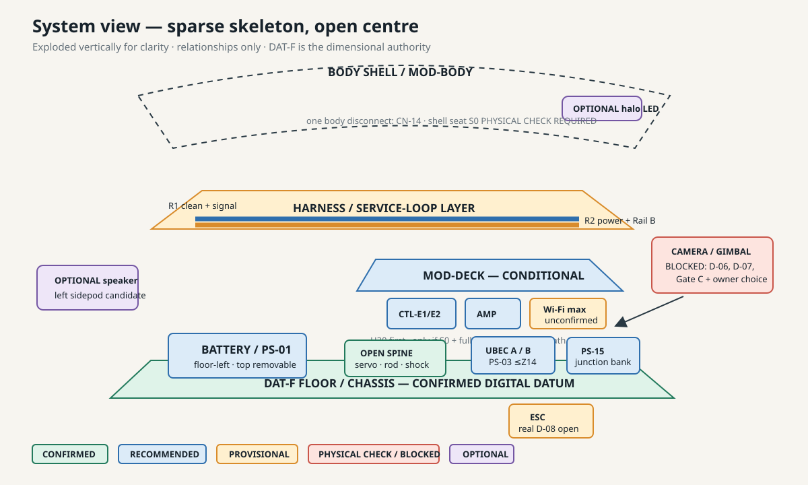

**Figure 01 — system/layer model.** Trace: `I` §§1–3, `V` §§4–7 and 13, `M` §1.

## 2. Approximate internal layout

### 2.1 Top view

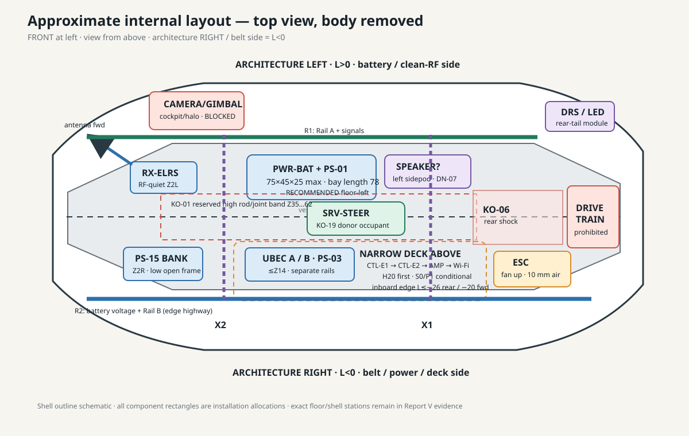

**Figure 02 — top packaging study, body removed.** Front is left. The drawing uses the
P0 convention: architecture-right/belt side is `L<0`; architecture-left is `L>0`.
Shapes are allocations, not installed-part outlines.

Placement confidence is strongest for the chassis datum, central mechanical occupants,
battery-bay length, steering reserved band, and donor drivetrain. It is moderate for
the recommended zone assignments. Exact controller, Wi-Fi, speaker, and gimbal shapes
remain provisional.

### 2.2 Longitudinal section

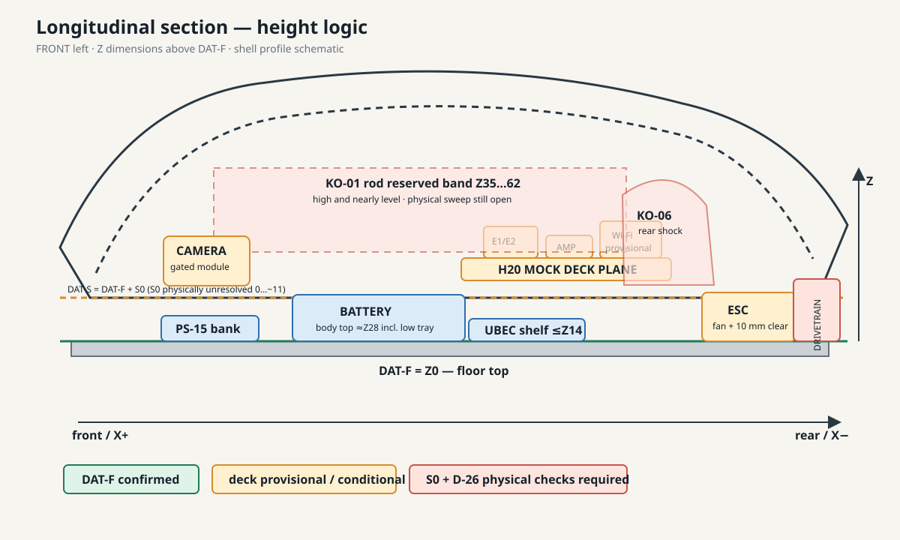

**Figure 03 — side/longitudinal section.** `DAT-F = Z0` is digitally confirmed. The
steering rod is a high, near-level physical keep-out (`Z 35–62`, digitally derived;
real lock-to-lock sweep required). Side-bay ceiling is `26–41 + S0`; `S0` is physically
unresolved in the digital range `0…~11 mm`. The H20 plane is therefore a diagnostic
trial, not a selected deck height.

### 2.3 Transverse section

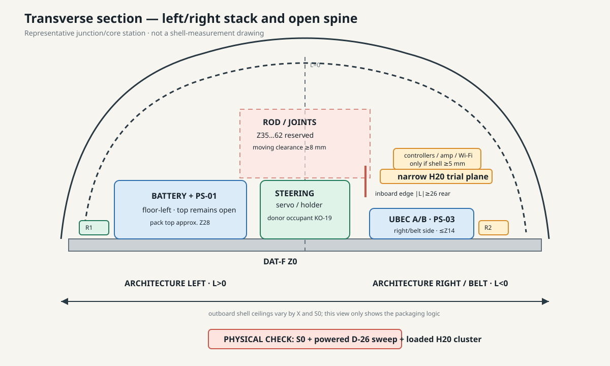

**Figure 04 — representative front/rear-facing section through the junction/core.**
The battery body top is about `Z28` including its low tray and passes below the P0 rod
band. The UBEC shelf is capped below `Z14`. Only the outboard right-side volume can
carry a deck; the inboard edge must respect `|L|≥26` near the rear/horn region and
`|L|≥20` forward. Shell shape is schematic; use `V` section drawings for measurements.

### 2.4 Semi-exploded module stack

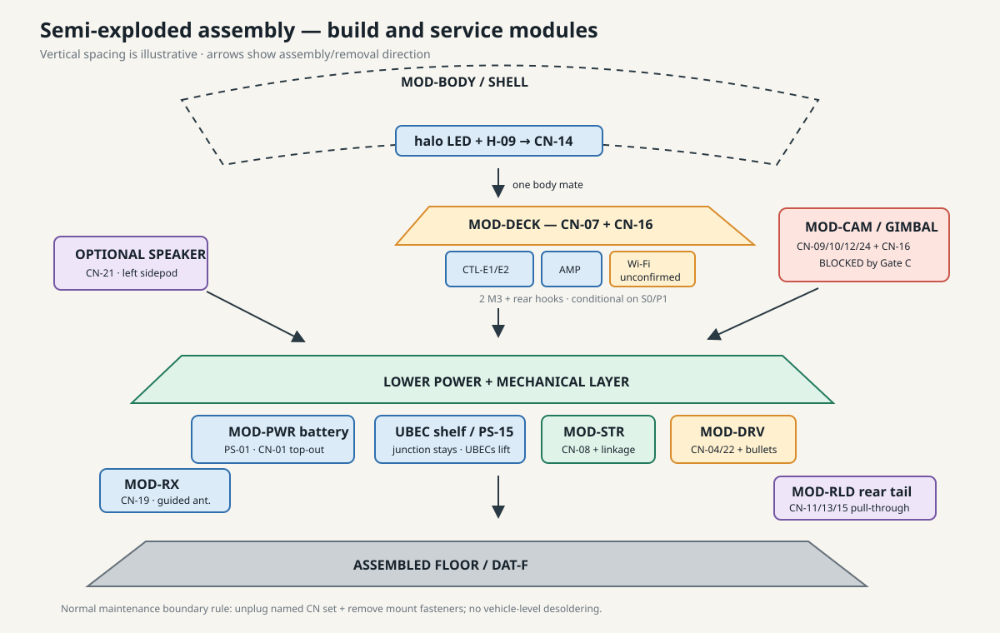

**Figure 05 — semi-exploded assembly model.** The intended unit boundaries are shell,
deck, camera/gimbal, receiver, power, drive, steering, and rear-tail modules. Normal
service must not require desoldering at the vehicle boundary. The camera-board solder
joint remains inside `MOD-CAM`; `CN-16` is the proposed camera-to-deck USB boundary.

## 3. Layer/skeleton trade study

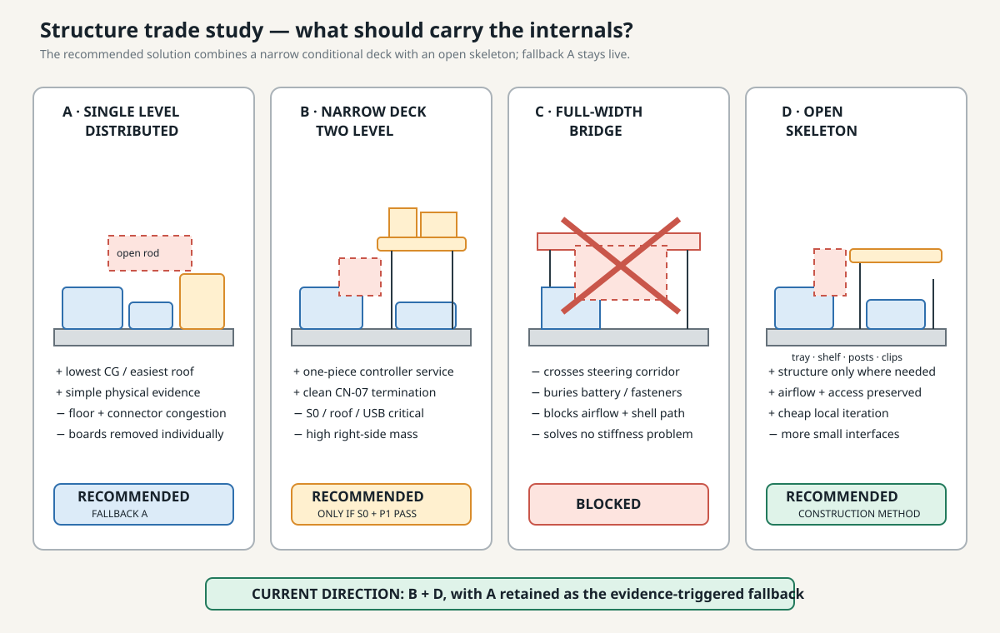

**Figure 06 — candidate structure comparison.** This manual carries forward the
Session-2 `B+D` hybrid selection only as **RECOMMENDED / CONDITIONAL**.

| Concept | Packaging | Assembly/service | Verdict |
|---|---|---|---|
| Single-level distributed | Lowest centre of gravity and no roof risk; greater floor congestion and more local carriers. | More individual plugs/fasteners; easiest shell clearance. | **RECOMMENDED fallback A** if the H20 cluster fails. |
| Narrow two-level deck | Best one-piece controller service and clean harness termination; adds right-side high mass. | Two deck screws plus `CN-07`, `CN-16`, and fragile U.FL handling. | **RECOMMENDED, conditional on `S0` + P1.** |
| Full-width bridge/single shelf | Apparently tidy, but crosses the steering band, buries battery access, and obstructs the central spine. | Poor removal and motion access. | **BLOCKED / rejected.** |
| Open skeleton/distributed posts | Adds structure only where a component needs it; preserves airflow and tool access. | More small supports, but failures are local and cheap to revise. | **RECOMMENDED construction method** for either viable layout. |

Practical interpretation: use trays, shelves, posts, and clips as a sparse skeleton.
Do not build a cage. A second layer is beneficial only when it turns the controller set
into a genuinely removable module without sacrificing shell, rod, USB, or connector
clearance.

## 4. Connectorization concept

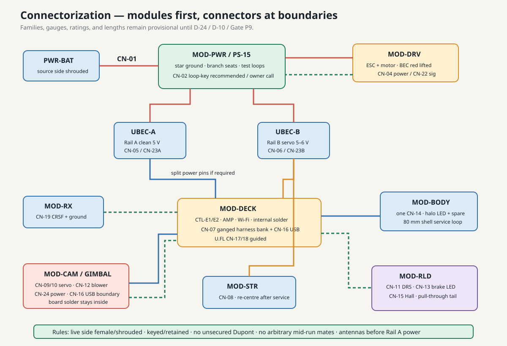

**Figure 07 — module-boundary connector strategy.** Trace: `M` §§1–3, `L` §§1–3,
`Q`. Connector families, gauges, current ratings, and lengths remain provisional until
the referenced electrical gates.

### Fixed inside a module

- Solder camera-board wiring and internal deck UART/I²S/data wiring where documented.
- Keep ESC motor phase/sensor leads with `MOD-DRV`; isolate and insulate the ESC BEC red
  conductor on the recommended topology.
- Keep LED strip tails soldered inside their body/rear modules.
- Fit fixed pigtails where repeated PCB handling would be worse than a harness mate:
  controller USB service pigtails only if DN-08 selects them; Wi-Fi coax stays guided
  and short rather than extended.

### Disconnect at service boundaries

- Battery: `CN-01`; master kill: `CN-02` loop-key if DN-02 is selected.
- Deck: `CN-07` harness bank plus proposed `CN-16`; U.FL `CN-17/18` must be supported
  at guides and kept out of normal high-cycle handling as far as the final layout allows.
- Steering: `CN-08`; camera/gimbal: `CN-09/10/12/24` plus `CN-16` at deck edge.
- Rear tail: `CN-11/13/15`; shell: a single `CN-14`; receiver: `CN-19`.
- ESC: `CN-04` power and `CN-22` signal, with the red BEC pin absent/insulated.

### Gender and assembly rules

- The potentially live side receives female/shrouded contacts.
- Use keyed/polarized and retained connectors; no unsecured Dupont connections in the
  completed vehicle.
- Add service loops only at named removal or moving interfaces; do not insert arbitrary
  mid-run connectors.
- Connect antennas and bond the Wi-Fi heatsink before any Rail-A power.
- Rails remain off during USB programming unless the dev-board back-power path is
  physically verified at Gate P4.

## 5. Harness and routing concept

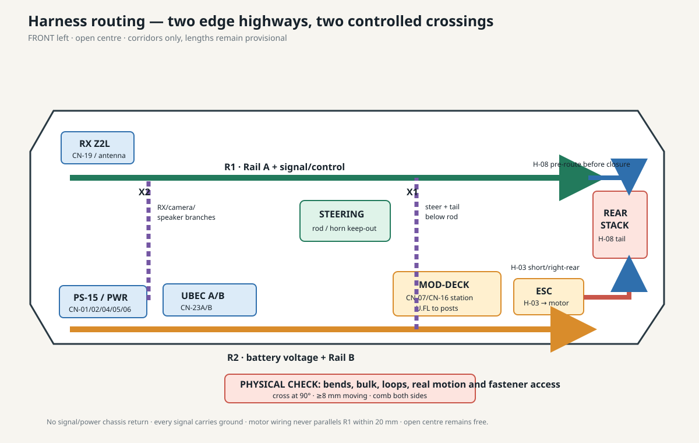

**Figure 08 — physical routing, top view.** Trace: `N` §§1–5. `R1` carries Rail A and
signals along the left edge. `R2` carries battery voltage and Rail B along the right
edge. The centre is crossed only at `X1` and `X2`, at 90°, below the physical steering
rod line and with at least 8 mm to moving parts.

| Run | Contents | Important handling rule |
|---|---|---|
| `H-01/H-02` | Battery, junction, UBEC inputs | Short, restrained, connector faces reachable. |
| `H-03` | ESC and motor power | Right-rear only; short/together; never parallel to `R1` within 20 mm. |
| `H-04` | Clean Rail A, LEDs, receiver/camera branches | Use `X2` for required cross-feed; keep away from motor wiring. |
| `H-05` | Rail B servo/blower feeds | Exit steering at `X1`; loops at gimbal/DRS only. |
| `H-06/H-07` | Control, audio, CRSF, camera USB | Twisted/ground-paired where specified; `H-07 ≤150 mm`. |
| `H-08` | Brake LED, Hall, DRS rear tail | **Route before the rear stack closes**; retain pull-through loop. |
| `H-09/H-10` | Body LED and Wi-Fi coax | One body connector; coax ≤80 mm, no tight bend or shell tether. |

Harness-bulk and bend compliance remain **PHYSICAL CHECK REQUIRED** (`D-10`). The
figures intentionally show routes as corridors, not exact wire lengths.

## 6. Support-part concept

The support system is an open skeleton whose parts each solve one access, retention,
or routing problem. Current diagnostic renders are useful shape evidence, but they are
not installed-production parts.

| Part | Role | Current status | What still controls it |
|---|---|---|---|
| `PS-01` battery tray | Top-removable restraint, XT60 exit, strap, balance-lead park, ballast land. | **DIAG-CAD / PHYSICAL CHECK REQUIRED** | S0, floor/screw condition, clamp coupon, balance. |
| `PS-03` UBEC shelf | Separate Rail-A/B pockets, lead combs, airflow, post shoulders. | **DIAG-CAD / PHYSICAL CHECK REQUIRED** | Real UBECs, D-24 upsize risk, final floor occupancy. |
| `PS-05` posts | Test H20/H26/H32 deck planes without creating a deck. | **DIAG-CAD gauges** | Choose lowest passing height only after S0 and service trials. |
| `PS-15` junction support | Open, vent-safe connector/test-point frame with decision blanks. | **DIAG-CAD / decisions open** | DN-01, DN-02, D-24, physical key/finger access. |
| clamp feet | Reversible no-new-hole diagnostic attachment. | **PROVISIONAL coupon** | Plate-edge fit, three cycles, unloaded pull-off; not dynamic retention. |
| `PS-04` deck | One-piece controllers/Wi-Fi/amplifier carrier. | **BLOCKED for CAD-05** | S0, full H20 cluster, D-06b, D-26/service clearances. |
| `PS-02/06/08/09` | ESC carrier, RX carrier, combs, rear-tail guide. | **CONCEPT / later diagnostic** | Real hardware, P1, Gate A, routing bulk. |
| `PS-10/11/14/17` | Gimbal/duct, speaker, USB service carriers. | **BLOCKED or OPTIONAL** | D-06/D-07/Gate C, D-03/DN-07, D-11/DN-08. |

Local CAD evidence:

| PS-01 tray | PS-03 shelf | PS-05 post gauges | PS-15 support |
|---|---|---|---|
|  |  |  |  |

The PNGs above are ignored local outputs regenerated from tracked sources. See the
[asset register](asset_register.md) if they are absent.

## 7. Approximate assembly sequence

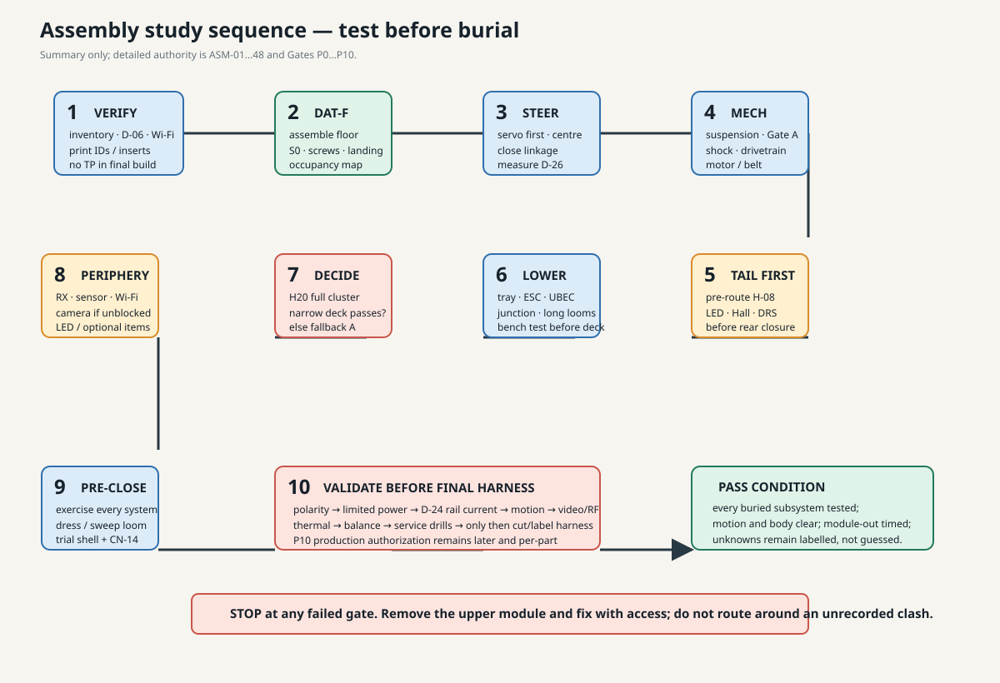

**Figure 09 — study-level sequence.** The detailed authority remains `P` ASM-01…48.

1. **Verify evidence and parts.** Measure D-06 camera; confirm Wi-Fi possession/status;
   inspect prints; prepare inserts. Do not let a TP-labelled part enter the vehicle.
2. **Assemble the bare floor/datum.** Confirm DAT-F flatness, screw protrusion, body
   landing points, physical `S0`, belt-side naming, and D-27 occupancy.
3. **Install and centre steering early.** Fit servo/holder, current-limit power, centre
   it, fit horn, close linkage, and record real D-26 lock-to-lock sweep.
4. **Complete mechanical core.** Front suspension, Gate-A-qualified rear suspension,
   shock, drivetrain, axle sleeves, belt, and motor.
5. **Pre-route the rear tail.** Install `H-08` and its pull-through/service loops before
   rear-stack access disappears.
6. **Build/test the lower layer.** Fit tray, ESC carrier, UBEC shelf, junction, combs;
   place battery/ESC/UBEC/connector dummies; verify motion and removal. Install long,
   uncut harnesses and bench-test rails before burial.
7. **Choose the upper architecture from evidence.** Trial H20, then only necessary
   H26/H32 planes. Continue narrow deck only if the complete cluster passes; otherwise
   return to fallback A. Bench-build the deck module before installing it.
8. **Add peripheral modules.** RX, sensors, real Wi-Fi only after measure/heatsink/
   antennas, gated camera/gimbal, LEDs, optional DRS/speaker, and final cable restraint.
9. **Verify before shell closure.** Exercise every installed subsystem body-off, then
   trial-lower the shell, mate only `CN-14`, and check pinching/5 mm clearance.
10. **Electrical, motion, thermal, RF, balance, and service gates.** Only after P7/P8
    data may the harness be cut to final length. Production CAD remains a later,
    per-part P10 owner authorization.

Any inaccessible lower-layer fault found after Step 7 means the sequence failed; remove
the deck rather than debugging through a cramped gap.

## 8. Service/removal concept

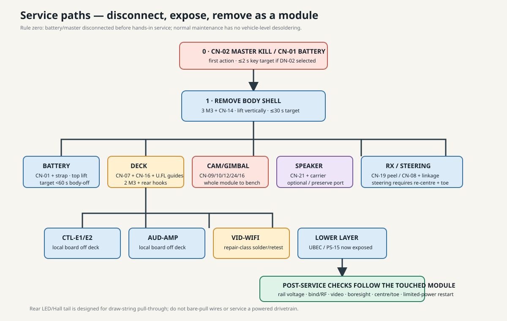

**Figure 10 — removal dependency map.** Trace: `Q`.

| Item | Normal removal path | Target / recalibration |
|---|---|---|
| Body shell | Pull master key; remove 3 M3; unplug only `CN-14`; lift vertically. | ≤30 s body-off target; protect paint. |
| Battery | Body off → `CN-01` → strap → top lift. | <60 s body-off; no recalibration. |
| Deck | Body off → `CN-07` + `CN-16`; support U.FL at guides; 2 M3; unhook/lift. | <60 s; no board recalibration. |
| UBEC shelf / junction | Body and deck off; unplug named input/output connectors; release screw/clamp. | Recheck rail voltage or limited-power startup. |
| Controllers / amplifier / Wi-Fi | Remove deck as a bench module; then remove the local board. | Wi-Fi replacement is repair-class solder work and needs video/RF retest. |
| Receiver | Body off; `CN-19`; peel/lift while preserving antenna guide geometry. | Rebind and spot-check link quality. |
| Camera/gimbal | Body off; unplug `CN-09/10/12/24/16`; remove module to bench. | Re-centre, boresight, roll, and hard-stop record. |
| Speaker | Body off; unplug `CN-21`; release carrier. | No recalibration; preserve isolation/port. |
| Steering servo | Body off; possibly tray out; open linkage; `CN-08`; holder out. | Mandatory firmware centre and toe reset. |

Emergency service begins with `CN-02` key removal if DN-02 is selected. No hands-in
service is permitted while the drivetrain can spin.

## 9. Conflict and uncertainty atlas

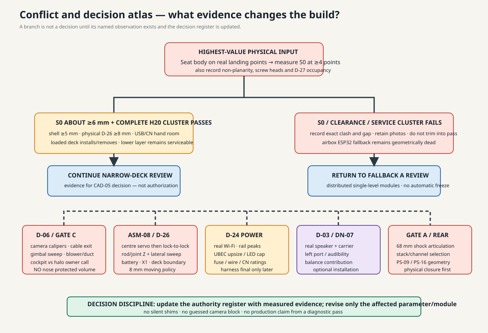

**Figure 11 — primary physical checks and decision branches.** Nothing in this page
silently resolves an owner decision.

| Area | Current evidence | Status / action |
|---|---|---|
| Right-deck viability | P0 side ceiling `26–41 + S0`; deck credible only as narrow H20-ish plane in an `S0≥~6` world. | **PHYSICAL CHECK REQUIRED:** measure S0 and trial the complete cluster. |
| Camera/gimbal | Camera hardware envelope D-06 absent; nose has no protected volume. | **BLOCKED:** calipers + Gate C + cockpit/halo owner choice. |
| Steering corridor | Digital rod band `Z35–62`, `|L|≤18→12`. | **PHYSICAL CHECK REQUIRED:** powered centred lock-to-lock ASM-08. |
| Fastener occupancy | Digital map: one candidate per side bay, none in Z2R; donor occupancy can differ physically. | **PHYSICAL CHECK REQUIRED:** mark every position; clamps/shared screws only by evidence. |
| Body registration | Shell frame and lower-bound clearances reproduced; landing bosses/S0 unresolved. | **PHYSICAL CHECK REQUIRED:** seat on real landing geometry and measure ≥4 points. |
| Connector congestion | CN-07/CN-16/USB/coax share the deck front/rear access logic. | **PROVISIONAL:** hand/bend/removal gauges at P1; no guessed bulkhead wall. |
| Speaker | Both sidepods geometrically accept Ø28–40 × 6–12 mm candidates; left improves balance. | **OPTIONAL / GATED:** real speaker, port/audibility, DN-07. |
| Rear stack | Gate A and physical shock/articulation still govern rear routing/support geometry. | **BLOCKED:** no PS-09/16 production shape before Gate A. |
| Power sizing | Rail A worst-case estimate ≈6 A vs 5 A UBEC; Rail B realistic peak ≈4.5 A. | **PROVISIONAL:** D-24 determines cap, UBEC, fuse, wire, and connector ratings. |

## 10. Decisions this atlas is intended to drive

1. **Narrow deck versus fallback A:** decide from S0 + H20 full-cluster evidence, not
   from an empty post gauge or shell held by hand.
2. **Second layer value:** retain it only if loaded deck-out is genuinely simpler and
   clear; height alone is not a success criterion.
3. **Connector-bank location:** keep the low front-right/open L-frame concept if
   connectors, fingers, vent/body seat, and body-on key access all pass.
4. **Battery/UBEC relationship:** use opposing floor-level modules for balance and
   service; never stack over the battery. Keep UBECs below the removable deck only if
   they remain independently liftable and thermally acceptable.
5. **Speaker side:** prefer left sidepod if real dimensions/acoustics pass because the
   current mass ledger is right-heavy by roughly 30–60 g without it.
6. **Module boundaries:** preserve one shell connector, one deck harness station,
   one removable camera module, and pull-through rear tail. Accept solder only inside a
   bench-removable module.
7. **Post/attachment method:** select the lowest passing post height and the least
   invasive verified attachment; a clamp coupon is not yet a load-rated mount.
8. **Camera location:** cockpit/halo remains an owner decision after D-06/D-07; the
   visible nose is numerically disfavoured and should not be used as protected volume.

## 11. Evidence boundaries and next physical session

The most valuable next session is not more layout drawing. It is the staged P1 evidence
session in `cad/reports/P1_print_preflight.md` and `P1_dry_fit_checklist.md`:

- measure D-06 first;
- assemble/inspect DAT-F and body landing points;
- measure screw protrusion, belt-side mapping, D-27 occupancy, and `S0`;
- close/measure the real steering sweep;
- print the minimum coupons/dummies only after Bambu preview passes;
- trial battery, UBEC, junction, and the complete deck cluster with hand/bend/removal
  volumes present;
- photograph measured gaps and retain failures as evidence.

Do not activate camera-to-control paths while assessing gimbal packaging. The workspace
safety boundary remains: stick-driven CRSF only for later gimbal motion tests; no
head-tracking/iPhone path into firmware or servos.

## 12. Primary engineering sources

- [`V_P0_geometry_measurement_results.md`](../V_P0_geometry_measurement_results.md) — measured geometry and S0 residual.
- [`W_session4A_P0_verification.md`](../W_session4A_P0_verification.md) — independent reproduction/verdict.
- [`I_zone_layer_plan.md`](../I_zone_layer_plan.md) and [`J_component_placement_matrix.md`](../J_component_placement_matrix.md) — zones and placements.
- [`K_printable_support_spec.md`](../K_printable_support_spec.md) and [`T_cad_task_spec.md`](../T_cad_task_spec.md) — support roles and diagnostic limits.
- [`L_power_architecture.md`](../L_power_architecture.md), [`M_connector_harness_matrix.md`](../M_connector_harness_matrix.md), and [`N_cable_routing_plan.md`](../N_cable_routing_plan.md) — power, connector, and route authority.
- [`P_assembly_master_manual.md`](../P_assembly_master_manual.md), [`Q_service_disassembly_guide.md`](../Q_service_disassembly_guide.md), and [`R_validation_gates.md`](../R_validation_gates.md) — sequence/service/gates.
- [`cad/reports/diagnostic_cad_manifest.md`](../cad/reports/diagnostic_cad_manifest.md) and [`cad/reports/generated_part_validation.md`](../cad/reports/generated_part_validation.md) — implemented diagnostic evidence.

---

**Manual status:** useful for architecture and P1 planning; not sufficient for final
dimensions, connector procurement/rating, production support CAD, or powered assembly.
